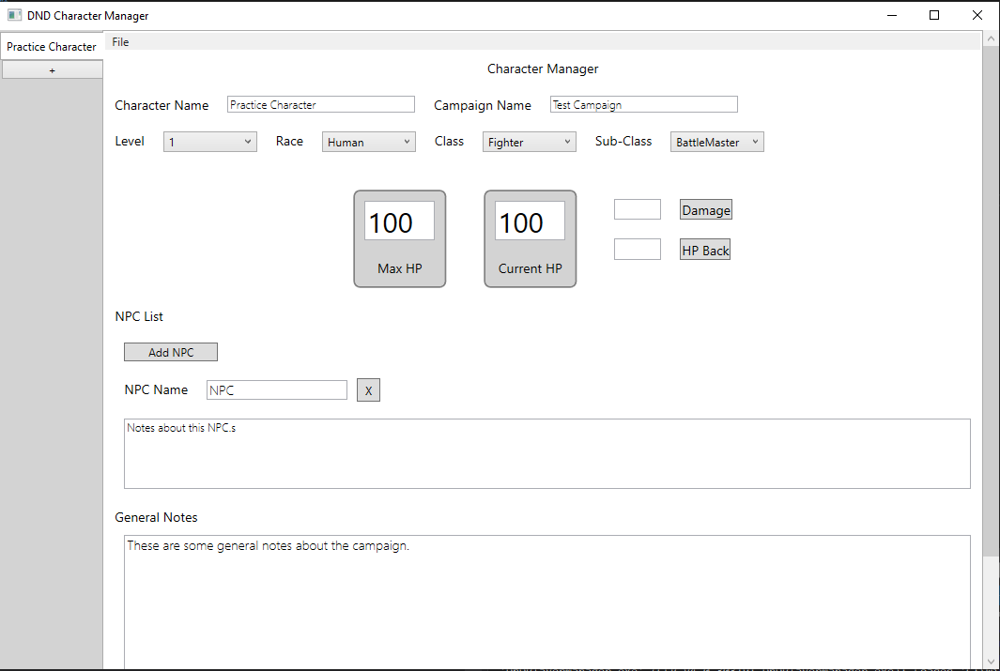

# D&D Player Manager

## _Overview_

This project is a tool for managing characters in long-form Dungeons and Dragons campaigns. This tool acts as a perfect companion to the standard D&D character sheet.

### Features
- General Details
  - Character Name
  - Campaign Name
  - Character Level
  - Character Race
  - Character Class
  - Character Sub-class
- Health Management
- Campaign NPC Management
- General Campaign Notes

### How It Works

The left side bar allows the user to add and manage multiple characters at a time. When done adding or editing a character, save your progress by pressing the `File->Save` button in the top left corner. `ctrl+s` will perform the same functionality.

XML save files are saved at `Data/Save`. Class, Sub-class, and Race data is saved in the `Data` folder.  When the application opens, it will look to the `Data/Save` folder for saved characters. If the folder is empty, the tool will load a blank character manager. Feel free to manipulate those files to add homebrew Classes, Sub-classes, and Races.

#### Development

This tool was written in C#/.NET and was creating using the Microsoft Windows Presentation Foundation UI framework. Free use for everyone. MIT License.
